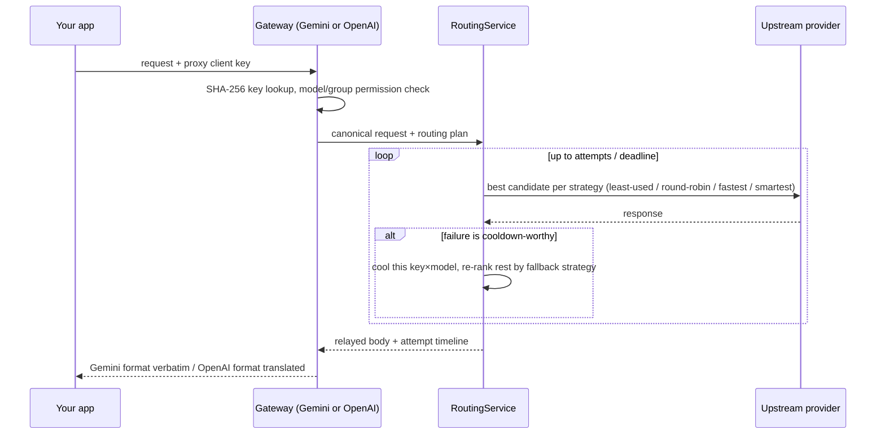

# Gemini Proxy

A self-hosted Gemini API proxy that pools multiple Google Gemini API keys behind one stable endpoint. It picks the best available key for every request, handles rate limits and cooldowns automatically, and speaks the standard Gemini API — so any app that can call Gemini can use it without changes.

## Features

* Multiple Gemini API keys pooled behind one proxy endpoint
* **Two protocol gateways on separate ports** — native Gemini (`/v1beta/*`) and OpenAI-compatible (`/v1/chat/completions`); each surface always expects its own wire format, no sniffing or guesswork
* **Best-key selection** — ready keys first (least-used rotation per model); if none are ready, cooled keys are still tried as last resort, soonest-expiring cooldown first
* Automatic retry on another key when one fails (tunable in **Settings**)
* Automatic cooldown when a key hits rate limits, transient errors, or daily quota
* Upstream responses relayed verbatim (Gemini gateway) or translated faithfully into OpenAI shape (OpenAI gateway)
* Per-key and per-model usage tracking in a web dashboard
* Model discovery from Google, served from a local cache so `/v1beta/models` and `/v1/models` answer instantly
* Web dashboard: overview stats, client keys, provider credentials, model cache, request logs with timeline and payload inspection
* **Isolated surfaces**: dashboard/admin can run localhost-only while only the gateway ports are exposed publicly
* SQLite storage — no external database needed
* Provider credentials encrypted at rest (AES-256-GCM)
* Docker and Docker Compose support, non-root container with healthcheck
* Client authentication with your own proxy API keys

---

## Architecture

The server is a modular TypeScript/Fastify application. One process hosts **three independent HTTP servers**, each with its own port and purpose:

| Surface | Port | Speaks |
| --- | --- | --- |
| **Gemini gateway** | `18770` | Gemini protocol only (`/v1beta/*`) |
| **OpenAI gateway** | `18771` | OpenAI protocol only (`/v1/chat/completions`, `/v1/models`) |
| **Dashboard + admin API** | `18765` | Web UI under `/`, admin JSON under `/api/admin/v1/*`, health checks |

All three ports are published as-is by the shipped compose file. To change a public port or restrict an interface, edit the `ports:` mappings in `docker-compose.yml`. Source runs (no Docker) bind the dashboard to loopback unless `ADMIN_HOST` says otherwise.

### Anatomy of a routed request



Because each surface always knows which wire format it is receiving, there is no format detection: the Gemini gateway forwards Gemini bodies (translating per provider adapter), while the OpenAI gateway translates chat-completion requests into the canonical internal shape before routing.

Request flow: route → auth → validation → use case → router/adapters → repositories.

```text
src/
├── main.ts                  bootstrap, three listeners, graceful shutdown
├── config/env.ts            Zod-validated environment configuration
├── shared/                  types, crypto (AES-GCM, hashing), time helpers
├── infrastructure/
│   ├── db/                  SQLite connection, versioned migrations, repositories
│   ├── logging/             pino logger with secret masking
│   └── providers/           gemini + openai-compatible upstream adapters
├── domain/
│   ├── auth/                admin sessions
│   ├── providers/           adapter interface + error classification
│   └── routing/             cooldown policies + key selection ordering
├── application/gateway/     routing service (retries/deadline/logging), model cache,
│                            OpenAI ⇄ canonical translation
└── http/
    ├── server.ts            composition root building the three servers
    └── routes/              health, gemini gateway, openai gateway, auth, admin
web/                         React 19 + Vite dashboard (built to dist-web/)
```

Gemini-gateway responses are relayed verbatim; the proxy never rewrites bodies there.
Every attempt is logged with a trace id, timeline events, classification,
latency, and truncated/masked payloads.

---

# Quick Start (Docker Compose)

You only need Docker installed. **No configuration is required to boot** — the admin password is created in the browser on first open.

```bash
mkdir gemini-proxy && cd gemini-proxy
curl -fsSL -O https://raw.githubusercontent.com/muhammad-sho/Gemini_proxy/main/docker-compose.yml
docker compose up -d
```

Open the dashboard at `http://localhost:18765` (or `http://SERVER_IP:18765` from another machine — all three surfaces are published by default; see "Ports and Exposure" to lock down).

First-time setup:

1. Open the dashboard and create the admin password (first run only).
2. Open **Providers** and add your Google Gemini API keys.
3. Open **Client Keys** and generate a key for your application (shown once).
4. Tune routing and log retention under **Settings** if needed — everything else runs on sensible defaults.

All app data lives in the `./data` folder next to `docker-compose.yml` — that single folder is your backup.

### Run from source (development)

Requires Node.js 22+.

```bash
git clone https://github.com/muhammad-sho/Gemini_proxy.git
cd Gemini_proxy
npm install --legacy-peer-deps
npm run dev          # tsx watch on src/
```

Production-style local run:

```bash
npm run build        # tsc -> dist/, vite -> dist-web/
NODE_ENV=production npm start
```

Useful scripts: `npm run check` (typecheck server+web, lint, tests, dashboard build), `npm test` (Vitest), `npm run web:dev` (dashboard HMR against a running server).

---

# Dashboard

Sign in at `http://localhost:18765` (or wherever `ADMIN_HOST:ADMIN_PORT` points; see "Ports and Exposure"). Tabs:

| Tab | What it does |
| --- | --- |
| **Overview** | Totals (client keys, provider keys, groups), active cooldowns, usage per model/key, clear-cooldowns action |
| **Client keys** | Generate/revoke the API keys your applications use; restrict by model or group |
| **Providers** | Add/edit provider keys; available models are fetched live from the upstream while you type — pick the ones this key serves (nothing else is stored) |
| **Groups** | Route over explicit key × model targets with a rotation role: least used, round robin, fastest, smartest (+ optional fallback) |
| **Logs** | Every request with outcome/status/attempt filters and body search; click a row for the full timeline and payloads |
| **Settings** | Routing behavior and log retention, applied live — no restart needed (see "Configuration") |

---

# API Usage

Both gateways serve the same credential pool; pick whichever protocol your app already speaks and swap the URL and key. Streaming (`streamGenerateContent` / `"stream": true`) is not proxied; unsupported actions are rejected with a clear 404/400 instead of hanging.

## Gemini-protocol gateway (`:18770`)

Endpoints: `GET /v1beta/models`, `POST /v1beta/models/{model}:generateContent`, and `POST /v1beta/models/{model}:countTokens` (countTokens is served by native Gemini credentials only).

The client key can be sent as `x-goog-api-key`, `Authorization: Bearer <key>`, or `?key=`:

```bash
curl http://GATEWAY_HOST:18770/v1beta/models/gemini-2.0-flash:generateContent \
  -H "Content-Type: application/json" \
  -H "x-goog-api-key: YOUR-CLIENT-KEY" \
  -d '{"contents":[{"parts":[{"text":"Say hello"}]}]}'
```

The response is Google's response, unchanged — including errors after all retries fail.

## OpenAI-protocol gateway (`:18771`)

Endpoints: `GET /v1/models` and `POST /v1/chat/completions`, authenticated with `Authorization: Bearer <key>`:

```bash
curl http://GATEWAY_HOST:18771/v1/chat/completions \
  -H "Content-Type: application/json" \
  -H "Authorization: Bearer YOUR-CLIENT-KEY" \
  -d '{
    "model": "gemini-2.0-flash",
    "messages": [
      { "role": "system", "content": "Be brief." },
      { "role": "user", "content": "Say hello" }
    ]
  }'
```

Requests arrive as OpenAI chat completions, are routed through the same key pool, and come back as standard OpenAI responses (`choices[].message.content`, `usage`, `finish_reason`). System messages map to Gemini system instructions; `temperature`, `top_p`, `max_tokens`/`max_completion_tokens`, and `stop` map to generation config. Errors use OpenAI's envelope:

```json
{ "error": { "message": "...", "type": "rate_limit_error", "code": 429 } }
```

## Proxy-origin errors

Errors originating from either gateway (bad client key, no credentials configured, deadline exhausted) share one normalized envelope with an HTTP-aligned numeric code:

```json
{ "error": { "code": 503, "message": "No provider credentials configured", "requestId": "..." } }
```

Admin API lives under `/api/admin/v1/*` on the dashboard port and requires the session cookie issued by `POST /api/admin/v1/login`; mutations additionally require the `x-csrf-token` header.

---

# Ports and Exposure

The shipped compose file publishes all three surfaces as-is, so the dashboard works out of the box from any machine that can reach the server. The gateway ports only accept proxy client keys; the dashboard port (`18765`) holds admin power (credentials management, logs with payloads), so lock it down if the server is shared or internet-facing:

1. **Firewall / host binding**: edit the mapping to `- "127.0.0.1:18765:18765"` in `docker-compose.yml` and `docker compose up -d`. Manage a remote server via SSH tunnel: `ssh -L 18765:127.0.0.1:18765 user@server`.
2. **Reverse proxy** with its own authentication in front of `/`, keeping the port firewalled.
3. **Source runs**: `ADMIN_HOST=127.0.0.1` (the default without Docker).

---

# Key Selection and Cooldowns

Routing always happens over explicit key × model pairs — `key1/model1` and `key2/model1` are different targets.

* **Plain model assignment**: a client key allowed to use a model rotates across *every* key serving it, least-used first.
* **Group assignment**: a group scopes requests to exactly its targets and applies its routing role — `least_used`, `round_robin`, `fastest` (lowest measured latency) or `smartest` (fewest errors, then fastest) — plus an optional fallback role used for later attempts after a failure.

If an attempt fails, the next-best candidate under the active strategy is tried until the configured attempt count or total deadline (dashboard **Settings**) is exhausted; the last upstream response is relayed as-is.

| Failure | Classification | Cooldown |
| --- | --- | --- |
| 400 "API key not valid" | invalid_key | 60 s |
| Rate limit / 408 / 5xx | transient | 60 s |
| Daily quota exceeded | daily_quota | Until midnight Pacific |
| Other 4xx | permanent | none |

Cooled-down keys drop out of rotation but remain last-resort candidates (soonest expiry first). Expired cooldowns are promoted back to ready automatically.

---

---

# API Reference

## Gateways (client keys)

| Method & path | Auth | Notes |
| --- | --- | --- |
| `GET :18770/v1beta/models` | `x-goog-api-key` / Bearer / `?key=` | Models selected on active credentials, filtered by the key's permissions |
| `POST :18770/v1beta/models/{model}:generateContent` | same | Relayed verbatim; only `:generateContent` is proxied |
| `GET :18771/v1/models` | `Authorization: Bearer` | OpenAI-format model list |
| `POST :18771/v1/chat/completions` | `Authorization: Bearer` | Translated to/from the internal format; `stream:true` rejected |

Proxy-origin errors use `{ "error": { "code": number, "message": string, "requestId": string } }`.

## Admin API (dashboard port, session cookie; mutations also send `x-csrf-token`)

| Method & path | Purpose |
| --- | --- |
| `GET /setup/status` · `POST /setup` | Public first-run provisioning (one-time) |
| `POST /login` · `POST /logout` | Brute-force bucket: 10/min/IP |
| `GET /state` | Everything the dashboard tabs render |
| `POST/PUT/DELETE /provider-credentials[/:id]`, `GET /:id/models` | Manage keys; live probe of available models |
| `POST /provider-models/probe` | Probe models for a not-yet-saved key |
| `GET/POST /groups`, `PUT/DELETE /groups/:id` | Pair-based groups with routing strategies |
| `POST/PUT/DELETE /client-keys[/:id]` | Client keys with model/group permissions |
| `GET /logs`, `GET /logs/:id` | Request logs with timeline + payloads |
| `GET /audit-logs` | Security log (who did what, when, from where) |
| `GET/PUT /settings` | Runtime tuning, applied immediately |
| `POST /models/refresh` *(removed)* — model lists are derived, nothing to refresh | |

---

# Configuration

Configuration lives in two tiers:

1. **Dashboard → Settings tab** (applied live, no restart): upstream attempts, total deadline, per-attempt timeout, log retention and stored body size. Persisted in the database.
2. **Built-in defaults for everything else.** Deployment-level values (ports, hosts, `LOG_LEVEL`, `TRUST_PROXY`) are plain environment variables when running from source, or edited directly in `docker-compose.yml`; unset values fall back to defaults. Transport safety limits (10 MB request bodies, 50 MB stored responses) are fixed and intentionally not configurable.

There is no `.env` file and no required configuration: `docker compose up -d` and create the admin password on first open.

There are no secrets to configure. The admin password is created in the browser on first open; the encryption key for provider credentials is generated automatically inside the data directory.

# Backup and migration

All app data lives in one folder: `./data` next to the compose file (`/data` inside the container). It holds:

* `gemini-proxy.db` (+ `-wal`/`-shm` while running) — admin password hash, client key hashes, settings, usage counters, cooldown state, request/audit logs
* `encryption.key` — key that decrypts stored provider credentials
* provider credentials themselves (AES-256-GCM encrypted)

Migrations run automatically at startup and are versioned in the `schema_version` table.

**Backup (app stopped):**

```bash
docker compose stop          # or Ctrl+C the process
tar czf gemini-proxy-backup-$(date +%F).tgz data/
```

**Backup (online):**

```bash
sqlite3 data/gemini-proxy.db ".backup 'data/backups/gemini-proxy-$(date +%F).db'"
```

**Restore / migrate to another machine:** stop the app, replace (or copy) the `data/` folder, start again. That's it — the folder is self-contained.

---

# Environment Variables

Everything runs on built-in defaults — there is no `.env` file and nothing to configure. Under Docker, edit `docker-compose.yml` directly (port mappings; optional `LOG_LEVEL` / `TRUST_PROXY` overrides are shown commented-out inside). When running from source, these environment variables are understood:

| Variable | Default | Meaning |
| --- | --- | --- |
| `LOG_LEVEL` | `info` (`debug` in dev) | Standard pino levels: `fatal`/`error`/`warn`/`info`/`debug`/`trace` |
| `TRUST_PROXY` | `false` | Set `true` behind a reverse proxy |
| `HSTS` | `false` | Send Strict-Transport-Security (enable only when served over HTTPS) |
| `GEMINI_PORT` / `OPENAI_PORT` / `ADMIN_PORT` | `18770` / `18771` / `18765` | Listen ports for the three surfaces |
| `GATEWAY_HOST` / `ADMIN_HOST` | `0.0.0.0` / `127.0.0.1` | Bind addresses (dashboard stays local by default without Docker) |

All secrets are masked in logs. Readiness (`/health/ready` on the admin port) checks database, schema version, and encryption-key availability.

---

# CI

GitHub Actions runs typecheck (server + web), ESLint, Vitest, the dashboard build, and a fresh-database migration smoke test on every push/PR: `.github/workflows/ci.yml`. Container images publish to GHCR on `main` and `v*.*.*` tags.

---

# Security

* **Surface isolation**: gateway ports speak only the API protocols and accept only proxy client keys; the dashboard is a separate port. It is published openly by default for easy self-hosting — bind it to loopback (see "Ports and Exposure") on shared or internet-facing machines.
* **No secrets in config files**: the admin password is created in the browser on first open (one-time setup endpoint; refuses once an account exists) and stored as a bcrypt hash.
* Admin auth: session cookie (`httpOnly`, SameSite=strict, `__Host-` prefixed over HTTPS) + CSRF token mirrored via `x-csrf-token`; login/setup sit in a dedicated 10/min/IP brute-force bucket and every action is audited.
* Client keys and passwords stored hashed (SHA-256 / bcrypt); lookups are hash-based so raw keys are never persisted.
* Provider credentials encrypted at rest with AES-256-GCM; the key is generated automatically inside `data/` — back up that folder to back up everything.
* Helmet headers on every surface, CSP for the dashboard; body-size limits everywhere; per-IP rate limiting on all three surfaces.
* Exposing the dashboard on shared networks? Bind it to loopback (`"127.0.0.1:18765:18765"`) or put an authenticated reverse proxy in front of it.

---

# Troubleshooting

* **401 Unauthorized** — missing/invalid client key; generate one under **Client Keys**.
* **Model not permitted** — the client key's allowlist doesn't include this model.
* **503 No API keys** — add a provider credential; cooled keys still count, this only appears with an empty pool.
* **Readiness failing on encryption** — the app cannot write its encryption key into `data/`; check disk space and folder permissions.
* **Forgot the admin password?** Stop the app, run `sqlite3 data/gemini-proxy.db "DELETE FROM admin_users; DELETE FROM admin_sessions;"`, start again — the dashboard offers first-run setup once more (client keys and provider credentials are unaffected).
* **Dashboard unreachable from another machine (Docker)** — check that the `ports:` mapping for 18765 isn't prefixed with `127.0.0.1:`, and that no firewall blocks the port. Source runs bind the dashboard to loopback by default (`ADMIN_HOST`).
* **Database read-only / SQLITE_CANTOPEN** — no action needed: the container entrypoint fixes `/data` ownership on startup and drops to an unprivileged user before running the server. If you override `user:` in Compose, point it at a uid that can write the mounted directory.

---

# Project

Repository: https://github.com/muhammad-sho/Gemini_proxy
